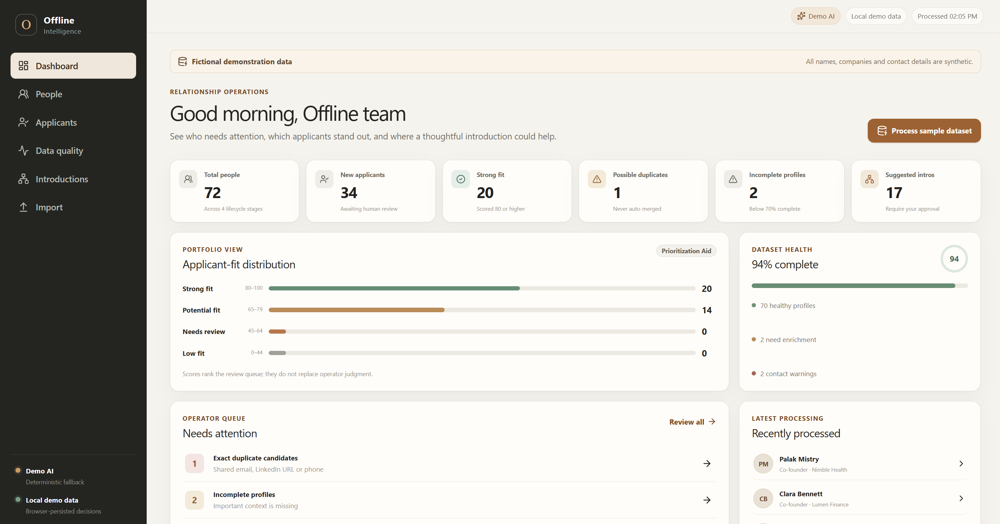
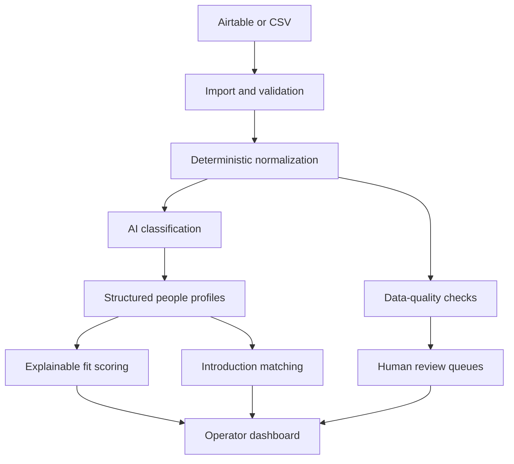

# Offline Intelligence

> An AI-native relationship CRM for founders and operators.

Offline Intelligence is a polished take-home prototype for turning inconsistent founder-community data into useful, reviewable operator workflows. It ships with 72 deterministic fictional profiles, works without paid services, and keeps scoring, matching, and data-quality decisions auditable.

## Screenshots



## Main capabilities

- Multi-stage demo processing flow with visible progress
- Searchable, filterable people directory and detailed profiles
- Paginated operator queues with accessible page controls and stable client-side ordering
- Deterministic normalization, validation, and completeness checks
- Exact, probable, and possible duplicate review queues
- Transparent applicant-fit scoring with six weighted components
- Reciprocal introduction matching, explanations, and editable drafts
- Human approval for merges and introductions; no external sends
- Browser-local decision persistence and a visible audit trail
- CSV validation preview and a stable seeded import path
- Optional OpenAI-compatible enrichment with deterministic fallback
- Supabase/PostgreSQL-compatible schema and repository boundary

All people and companies are fictional demonstration data.

## Architecture



The Next.js App Router UI reads from a typed application provider. `lib/data/process.ts` transforms `data/generated-people.ts` into cleaned profiles, duplicate candidates, fit assessments, introduction recommendations, and activity events. The local repository is the default; `SupabaseRepository` is the production seam rather than a pretend local database.

Long collections paginate after filtering and sorting against the deterministic local repository. Defaults are 10 people, 8 applicants, 5 introductions, 8 data-quality records, and 10 import-preview rows per page. People can also be viewed at 20 or 50 rows per page.

### Processing flow

1. Validate raw import rows and preserve the original values.
2. Normalize names, emails, phones, LinkedIn URLs, companies, titles, and lists.
3. Detect missing fields and contact warnings; calculate completeness.
4. Classify unstructured profiles through the selected AI provider.
5. Calculate the deterministic weighted applicant-fit score.
6. Detect duplicate candidates and score reciprocal introduction pairs.
7. Present all consequential actions for operator review.

## Deterministic logic vs AI

Deterministic code owns transformations with a known correct answer: normalization, validation, required fields, duplicate rules, completeness, score arithmetic, pair uniqueness, and the first compatibility score.

AI is used only where language understanding improves the result: bios, application responses, interests, expertise, goals, contribution signals, profile summaries, match explanations, and introduction drafts. AI responses are bounded and validated with Zod. Failed or malformed live calls fall back to the deterministic provider.

## Applicant-fit scoring

| Component | Maximum |
| --- | ---: |
| Founder or senior-operator relevance | 25 |
| Relevant experience | 20 |
| Community contribution potential | 20 |
| Application quality | 15 |
| Network relevance | 10 |
| Profile completeness | 10 |
| **Total** | **100** |

Categories are Strong fit (80–100), Potential fit (65–79), Needs review (45–64), and Low fit (0–44). The UI explicitly labels the score as a prioritization aid for human review.

## Introduction matching

The matcher begins with reciprocal `lookingFor` ↔ `canHelpWith` overlap, then considers shared industry, interests, location, founder/operator complementarity, different companies, self-match prevention, and unique unordered pairs. AI may improve the explanation and draft, but it does not decide whether to send anything.

## Local setup

Requirements: Node.js 22.13 or later and npm.

```bash
npm install
npm run dev
```

Open `http://localhost:3000`. The deterministic dataset and Demo AI work immediately.

### Environment variables

Copy `.env.example` to `.env.local` only when connecting optional services:

```env
AI_API_KEY=
AI_BASE_URL=
AI_MODEL=
NEXT_PUBLIC_SUPABASE_URL=
NEXT_PUBLIC_SUPABASE_ANON_KEY=
SUPABASE_SERVICE_ROLE_KEY=
```

Do not place secrets in variables prefixed with `NEXT_PUBLIC_`.

### OpenAI-compatible provider

Set `AI_API_KEY`, `AI_BASE_URL`, and `AI_MODEL`. Server route `POST /api/enrich` selects the live provider, requests structured JSON with low temperature, validates it, times out stalled requests, retries once, and falls back to Demo AI on failure. Without a key, `GET /api/enrich` reports demo mode.

### Supabase

Apply `supabase/migrations/001_offline_intelligence.sql` to a Supabase/PostgreSQL project, configure the three Supabase variables, and implement the methods in `SupabaseRepository`. The schema includes timestamps, review state, raw import auditability, constraints, and queue-oriented indexes. Local operation does not require Supabase.

## Testing and quality commands

```bash
npm run lint
npm run typecheck
npm test
npm run build
npx playwright install chromium
npm run test:e2e
```

Unit tests cover normalization, required fields, completeness, duplicate levels, score boundaries and arithmetic, introduction safeguards, AI validation, and fallback. The browser test follows the primary operator flow from processing through merge and introduction approval.

## Routes

- `/` — operational dashboard and processing run
- `/people` — directory and filters
- `/people/[id]` — profile, score, quality, matches, and actions
- `/data-quality` — duplicate, incomplete, and contact review
- `/applicants` — ranked applicants and score breakdowns
- `/introductions` — reciprocal matching and approval
- `/import` — demo/CSV preview and guarded processing

## Trade-offs and limitations

- Demo records and enrichment are deterministic so reviewers see stable output.
- Operator decisions persist in browser storage, not a production database.
- Uploaded CSVs are validated and previewed; the stable demo dataset remains the processed source in this prototype.
- The Supabase repository is a clear adapter seam, not a completed remote sync.
- Pagination is client-side for the deterministic prototype; production scale would move filtering and pagination into the Supabase repository with cursor-based server queries.
- The prototype has no authentication, role model, email send, calendar sync, or external enrichment.
- The server route uses a one-hour in-memory SHA-256 input cache; production should replace it with a shared durable cache across workers.

## Privacy and human review

The live provider input omits contact details and sends only context required for classification. Production use should add consent, purpose limitation, retention and deletion policies, tenant isolation, role-based access, immutable audit events, and a reviewed list of subprocessors. Duplicate merges and introductions always require human approval.

## Future improvements

Production Airtable synchronization, background processing, interaction history, feedback-driven ranking, opt-in enrichment, approved email/calendar workflows, role-based access, durable audit logs, monitoring, AI quality/cost metrics, and outcome measurement for accepted introductions.

See `docs/SUBMISSION_NOTE.md` for the concise take-home handoff.
